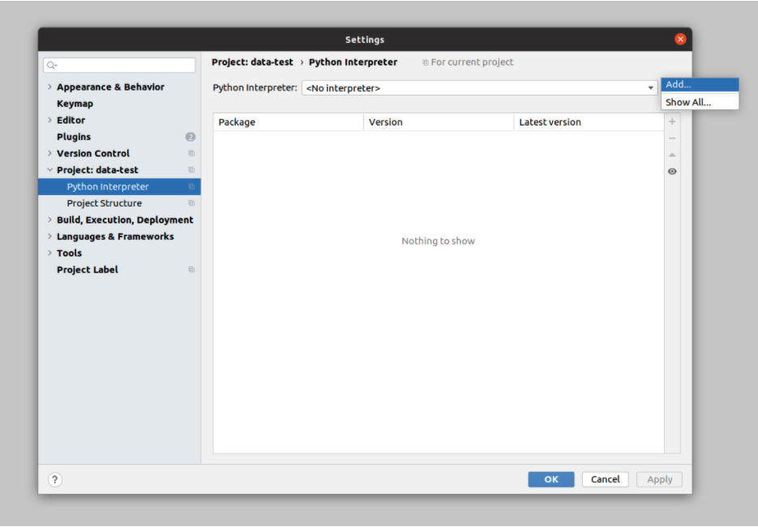
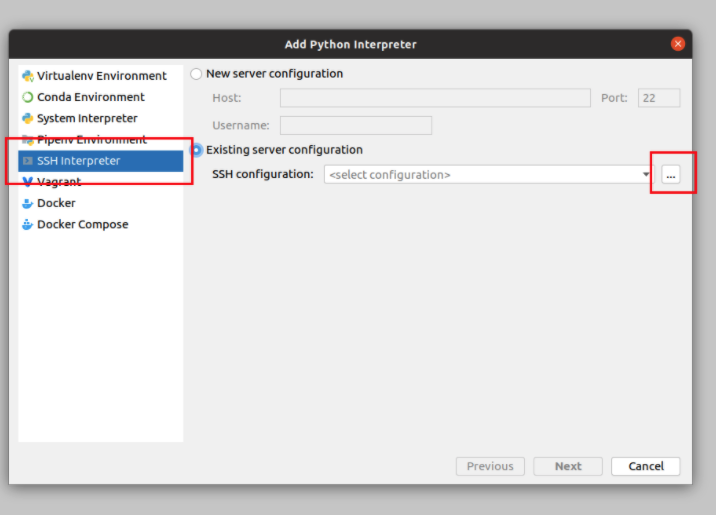
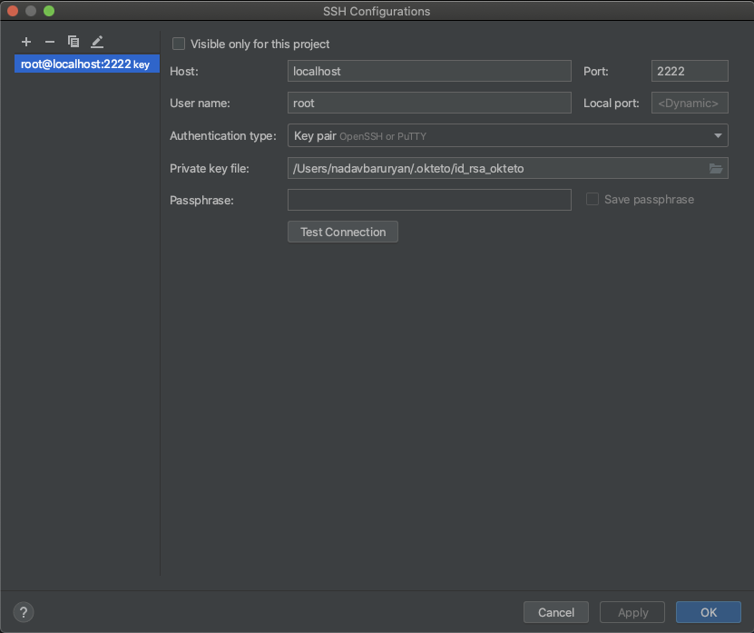
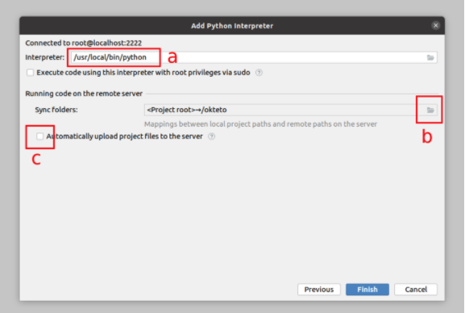
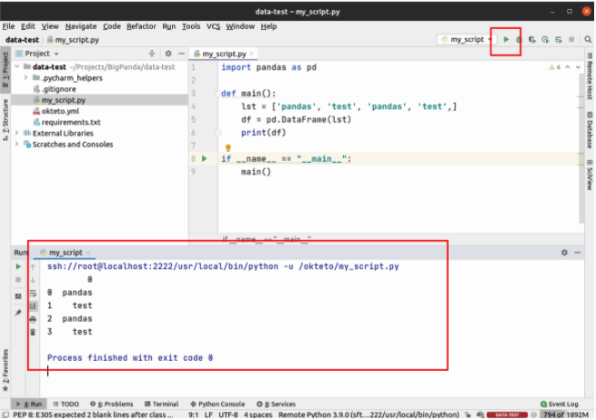
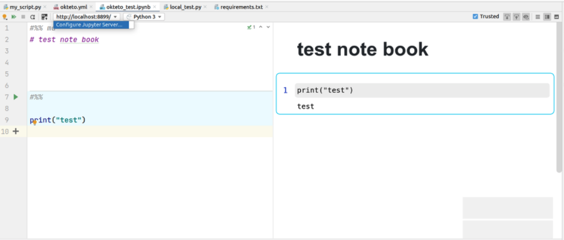
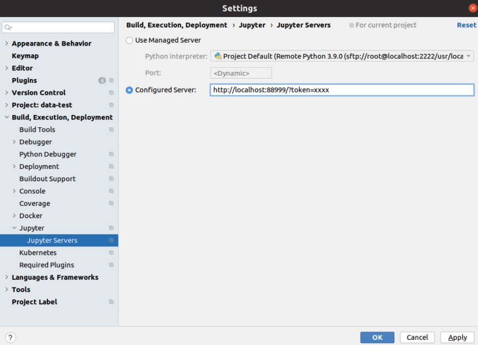

# Okteto-PyCharm setup

main contributes:

* Yahel Agassi - yahel@bigpanda.io
* Nadav Bar Uryan - nadav.bkl@gmail.com

#### Prerequisites
* Install the following:
* PyCharm Professional
* kubectl v1.16 brew install kubectl
* kubectx brew install kubectx
* awscli v2
* okteto cli - brew install okteto
* Update AWS toolkit plugin on PyCharm to the latest version


#### Set up k8s access
1) Download kubeconfig for the cluster
```aws eks update-kubeconfig --region <your-region> --name <context-name> --alias <context-alias>```
2) Switch to context
3) Create you namespace
```kubectl create ns <YOUR-NAME>```


   
## Set up Okteto

1) Make sure you’re using the correct AWS profile and K8s context

kubectx - select context

2) In your project’s root directory create a file called okteto.yml with content below. Replace the <PLACEHOLDERS> with your values, and define CPU and memory resources. The rest of the file should stay unchanged.


```namespace: <YOUR_NAME>
name: <PROJECT_NAME>

# define time-to-live (to reduce costs)
annotations:
 janitor/ttl: "12h"

# define resources
resources:
 requests:
   memory: "20G"
   cpu: "4"
 limits:
   memory: "30G"
   cpu: "6"

forward:
 - 8899:8899       # jupyter notebook port

# define ENVs below in your ~/.zshrc or ~/.bashrc
environment:
 - PYTHONPATH=/okteto

# Choose instance type using tolerations.
# Valid keys are aws/spot, aws/on-demand, aws/on-demand-gpu
tolerations:
 - key: aws/spot
   operator: Exists

### Don't change the content below.
image: okteto/python:3
command:
 - bash
volumes:
 - /root/.cache/pip
 - /root/.local/lib/python3.9/site-packages
 - /root/.local/bin/
sync:
 - .:/okteto
workdir: /okteto
remote: 2222
autocreate: true
```

** recommend installing janitor in k8s cluster
https://codeberg.org/hjacobs/kube-janitor

** we use taints and tolerations to specify which machines we want okteto to get us
https://kubernetes.io/docs/concepts/scheduling-eviction/taint-and-toleration/

3) In your project’s root directory create a file called .stignore with the content below. Fill in your local folders and files you wish to ignore and not to sync with Okteto. Large and unwanted folders are good to ignore.
(Additional reading: https://docs.syncthing.net/users/ignoring.html)
   
**ignore unwanted folders**

* venv
* .pytest_cache

**Important - never ignore .pycharm_helpers as the remote interpreter uses this folder**

4) Start Okteto
```okteto up```
   
NOTICE: If there are not enough resources available, k8s will launch a new worker node. This can take time and okteto up may sometimes fails with this error:
couldn't activate your development container:
kubernetes is taking too long to create your development container.
Please check for errors and try again
In this case just rerun okteto up.

5) When Okteto is up, you’ll be dropped into a shell inside the development pod, with all your project’s files in the current directory. Inside the pod, install your project’s Python dependencies.

```pip install --user -r requirements.txt```

6) Configure your Git username/email in okteto

```
git config --global user.name "FIRST_NAME LAST_NAME"
git config --global user.email "MY_NAME@example.com"
```

## Setup PyCharm Remote interpreter

1) Open PyCharm settings > Project > Python interpreter > ⚙️ icon > Add



2) Choose SSH interpreter > Existing server configuration > click on the three dots button



3) Click on the + sign and fill up the fields as in the image below. 
   **Change the Private key path to your home directory: /Users/<YOUR-NAME>/.okteto**

    When you run okteto up the first time, Okteto will create a SSH key pair for you and save it at $HOME/.okteto/id_rsa_okteto and $HOME/.okteto/id_rsa_okteto.pub. The SSH server launched in your development environment will be automatically configured to use these keys for authentication.



4) Click OK and next, to get to final configuration screen.

* Update the path to the interpreter to /usr/local/bin/python .
* Set the remote path to /okteto
* Disable file uploading, since Okteto will automatically take care of this for you.




## Develop locally; Run remotely
When your code is ready, you can run it remotely inside the development pod from PyCharm “Run” button.



## Stop Okteto when done
```okteto down```

## Running remote Jupyter notebooks using Okteto and PyCharm

1) Make sure you’ve set forward in your okteto.yml
```
forward:
 - 8899:8899       # jupyter notebook port
```

2) Start your development pod with
```okteto up```
   
3) Inside your development pod, install Jupyter (only once)
```pip install --user jupyter```
   
4) Inside your development pod, start notebook server
```/root/.local/bin/jupyter notebook --port=8899 --no-browser --allow-root```
   
to open jupyter in detach mode, run the following
```
kubectl get pods
kubectl exec -it <pod name> —- bash
apt install -y screen
screen -d -m -S jupyterServer -c '/root/.local/bin/jupyter notebook --port=8899 —no-browser —allow-root’
press - ctrl + a + d
```

Copy the url from the output and, replace the port with the local port from step 1: 8899
http://localhost:8899/?token=xxxx

5) Copy the url from the output and, replace the port with the local port from step 1: 8899
http://localhost:8899/?token=xxxx
6) In PyCharm, open a notebook and click on configure Jupyter server



7) Choose “configured server“ and paste the url



## Known issues:
if running jupyter in screen mode and due to network issue the connection is lost to the pod (and you cannot reconnect to the notebook)
run the following command in the local terminal - not oktteto terminal :
1. check that there is no active processes listening on the port 8899:
2. lsof -i:8899 (apt install lsof if needed) result should be empty
3. get pod name using - kubectl get pods
4. adjust the port forwarding using the
4. kubectl port-forward --address localhost pod/< pod name> 8899:8899

### Solve module import error for notebooks
In your okteto container (after okteto up)

1) Install vim ```apt update; apt install vim -y```

2) Create iPython configuration file for simpler handling of Jupyter notebooks with module 
```
imports:
pip install --user ipython
ipython profile create # or /root/.local/bin/ipython profile create
cd /okteto/
```
mv /root/.ipython/profile_default/ipython_kernel_config.py .
3) Edit the configuration file ```vim /okteto/ipython_kernel_config.py```
With this line:
```
c.InteractiveShellApp.exec_lines =['import sys; sys.path.append("/okteto")']
```

4) Launch a notebook that imports local modules and it should work fine now
You can check it by running the next commands from python notebook:
```
import sys
sys.path
```

The second path should be: “/okteto”
